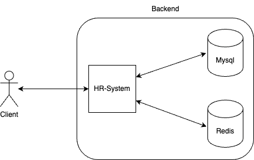

# HR-System

## Overview
A HR system backend service that allows administrators to log in and create employee profiles, and enables employees to clock in/out and view their attendance records

## Background and Motivation
Implement a HR system to practice system design

## Goals and Non-Goals
### Goals
#### Functional Requirement
- Default admin account with username "admin"
- Administrators can create new accounts
- Users can clock in/out, change passwords, and retrieve attendance records
#### Non-Functional Requirement
- Only one user can log in with an account at a time
- Re-login is required after changing password
### Non-Goals
- No RBAC implementation

## Detailed Design

### System Architecture

### Components
- HR-System: Handles business logic
- MySQL: Stores user and clock-in/out data
- Redis: Caches tokens and clock-in/out records

### Data Models
#### Account
| Field Name | Type | Description |
|--------|------|------|
| id | big int unsign | Unique identifier |
| account | varchar(255) | Account |
| type | tinyint unsign | type 1:admin 2:employee |
| name | varchar(255) | Name |
| pwd | varchar(255) | Encrypted password |
| created_at | datetime | Creation time |
| updated_at | datetime | Update time |

#### clock_in_record
| Field Name | Type | Description |
|--------|------|------|
| id | big int unsign | Unique identifier |
| account_id | big int unsign | Account ID |
| type | tinyint unsign | Type 1: Clock in 2: Clock out |
| created_at | datetime | Creation time |

### APIs
#### Login
- Method: POST
- URL: {host}/api/v1/login
##### Request 
- Content-Type: application/json

|parameter| type | description |
| - | - | - |
| account | string | account |
| password | string | password |

##### Response

|parameter| type | description |
| - | - | - |
| token | string | token, used for authentication in each request |

#### Change Password
- Method: POST
- URL: {host}/api/v1/changePassword

##### Request 
- Content-Type: application/json
- Authorization: Bearer {token}

|parameter| type | description |
| - | - | - |
| oldPassword | string | Old password |
| newPassword | string | New password |

##### Response
- http status code: 200
Please login again

#### Create Employee Account
- Method: POST
- URL: {host}/api/v1/account

##### Request 
- Content-Type: application/json
- Authorization: Bearer {token}

|parameter| type | description |
| - | - | - |
| account | string | account |
| name | string | name |

##### Response
- http status code: 200
Please ask user to change password immediately after login

|parameter| type | description |
| - | - | - |
| password | string | password |

#### Clock In/Out
Method: POST
URL: {host}/api/v1/clockInRecord

##### Request 
- Content-Type: application/json
- Authorization: Bearer {token}

|parameter| type | description |
| - | - | - |
| type | int | 1: Clock in 2: Clock out |

##### Response
- http status code: 200

#### Get Clock In/Out Records
Method: Get
URL: {host}/api/v1/clockInRecord

##### Request 
- Content-Type: application/json
- Authorization: Bearer {token}

|parameter| type | description |
| - | - | - |
| started_at | string | Start time, format: "YYYY-MM-DD HH:mm:ss" |
| ended_at | string | End time, format: "YYYY-MM-DD HH:mm:ss" |

##### Response
- http status code: 200

|parameter| type | description |
| - | - | - |
| records | record array | Array of clock in/out records |

record

|parameter| type | description |
| - | - | - |
| type | tinyint unsign | Type 1: Clock in 2: Clock out |
| created_at | datetime | Creation time |

## Testing Strategy
Use Golang's unit test to test functions
- TBD

## Dependencies
- [cobra](https://github.com/spf13/cobra)
- [viper](https://github.com/spf13/viper)
- [gorm](https://github.com/go-gorm/gorm)
- [gin](https://github.com/gin-gonic/gin)
- [go-redis](https://github.com/redis/go-redis)
- [zerolog](https://github.com/rs/zerolog)